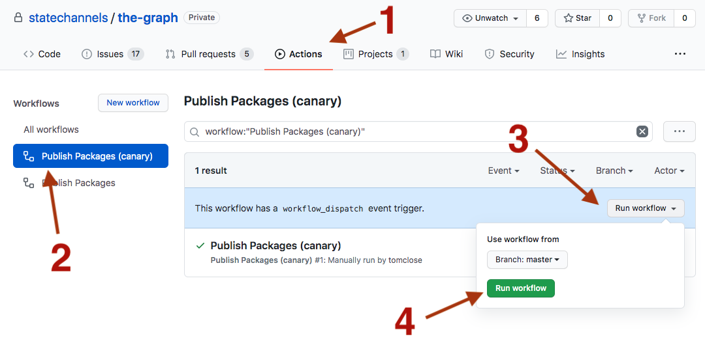

<h1 align="center">
  <br>
  <a href="https://statechannels.org"></a>
</h1>

<h4 align="center">Simple off-chain applications framework for Ethereum.</h4>

<p align="center">
  <a href="https://circleci.com/gh/statechannels/statechannels/tree/master"></a>
  <a href="https://lernajs.io/"></a>
  <a href="https://research.statechannels.org/"></a>
  <a href="./LICENSE"></a>
</p>
<br>

**statechannels** is a simple off-chain framework for building **state channel applications** on top of the Ethereum blockchain. It aims to make it simpler to build permissionless applications that have instant finality with zero-fee transactions.

You can learn more about what state channels are by reading [one](https://l4.ventures/papers/statechannels.pdf) or [other](https://magmo.com/force-move-games.pdf) of the whitepapers underpinning the project, or a less technical written [description](https://medium.com/blockchannel/state-channel-for-dummies-part-2-2ffef52220eb).

- [Packages](#packages)
- [Contributing](#contributing)
  - [Installing dependencies](#installing-dependencies)
  - [Building packages](#building-packages)
  - [Clean](#clean)
  - [Lint](#lint)
  - [Tests](#tests)
  - [Authoring conventional commits](#authoring-conventional-commits)
  - [Publishing packages](#publishing-packages)
    - [Fixing a failed publish](#fixing-a-failed-publish)
- [Typescript doc comments](#typescript-doc-comments)
- [API reports](#api-reports)
- [Community](#community)

## Packages

This repository is a monorepo, and contains the following packages maintained with [lerna](https://github.com/lerna/lerna) and [yarn workspaces](https://yarnpkg.com/lang/en/docs/workspaces/):

- [docs-website](./packages/docs-website/website) : Documentation website
- [client-api-schema](./packages/client-api-schema) : JSON-RPC based schema definitions for the Client API with TypeScript typings
- [devtools](./packages/devtools) : Developer tooling
- [jest-gas-reporter](./packages/jest-gas-reporter) : Reports the gas used by various calls to ethereum contracts
- [nitro-protocol](./packages/nitro-protocol) : Smart contracts and typescript support
- [wallet-core](./packages/wallet-core) : Core wallet code that works in node-js and browser contexts
- [wire-format](./packages/wire-format) : Format of messages that are sent over the wire between wallets

## Contributing

- **[Create a new issue](https://github.com/statechannels/monorepo/issues/new)** to report bugs
- **[Fix an issue](https://github.com/statechannels/statechannels/issues?state=open)**. statechannels is an [Open Source Project](.github/CONTRIBUTING.md)!

### Installing dependencies
  * **yarn** - version 1.22.4, for easy management of specific Yarn versions, we recommend using [Yarn Version Manager (YVM)](https://github.com/tophat/yvm).
  * **node** - version 2.18.0, for easy management of specific versions, we recommend using [n](https://github.com/tj/n).
  * **postgres** - we recommend [the postgres app](https://postgresapp.com/). If you choose this installation, make sure you follow [the following steps](https://postgresapp.com/documentation/install.html) to add postgres tools to you $PATH, better verify commands like 'createdb', 'dropdb' runs correctly in your terminal before proceeding.

```shell
sudo mkdir -p /etc/paths.d &&
echo /Applications/Postgres.app/Contents/Versions/latest/bin | sudo tee /etc/paths.d/postgresap
```

The rest of the dependencies can be installed by running

```shell
yarn
```

from the monorepo root.

### Building packages

To build all packages:

```shell
yarn build
```

### Clean

To clean all packages:

```shell
yarn clean
```

### Lint

To lint all packages:

```shell
yarn lint:check
```

To also apply automatic fixes:

```shell
yarn lint:write
```

### Tests

To create and migrate test db:
```shell
cd ./packages/server-wallet/
./src/test_db.sh server_wallet_test
``` 

To run all tests:

```shell
yarn test
```

### Authoring conventional commits

We follow the convention at https://github.com/conventional-changelog/commitlint/tree/master/%40commitlint/config-conventional. Your commits will be linted against this convention. You can do this yourself locally by running

```shell
yarn commitlint --from=HEAD~1 --verbose
```

For help authoring commits, you can check out https://commitizen.github.io/cz-cli/.

### Publishing packages

To publish you will need to trigger a github action:



1. Select the actions tab
2. Select whether you want to do a regular publish (`Publish Packages`) or a pre-release (`Publish Packages (canary)`)
3. Click on `Run workflow`
4. Select the branch (regular publishes will fail unless on master)
5. For regular publishes, a PR will be created to get the updated version and changelog info back into master. You should merge this immediately!

#### Fixing a failed publish

Sometimes things will go wrong on CI and the git tags will be created but the package will not be published.
To fix this you can do the following locally:

```
# fetch down any publish tags
git fetch --tags

# push packages to the registries, without creating new releases
npx lerna publish from-package
```

You might need a `npm login --registry https://testnet.thegraph.com/npm-registry/` if you don't
already have an access token in your `.npmrc`.

## Typescript doc comments

These should adhere to the [TSDoc standard](https://github.com/Microsoft/tsdoc). You can try the [TSDoc playground](https://microsoft.github.io/tsdoc/).

Doc comments will appear in our documentation at https://docs.statechannels.org.

## API reports
We use [api-extractor](https://api-extractor.com/) to help us track changes to the API of some of the packages in this repo. The tool is run via `yarn lerna run generate-api` during our continuous integration suite, and generates an [api report](https://api-extractor.com/pages/setup/configure_api_report/). If you make changes to the external API of a package, you should run this command locally and check in the reports to source control, else you will get a test failure. 

The checked-in report helps faciliate PR review.


## Community

State Channels Forums: https://research.statechannels.org/
